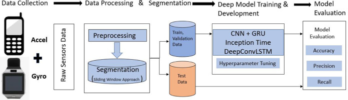
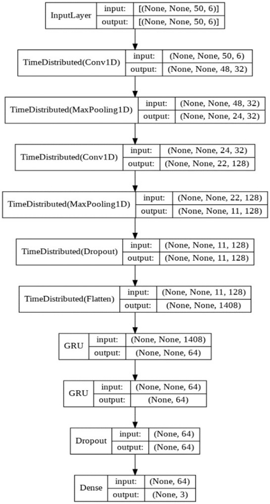

# Deep Learning based Human Activity Recognition (HAR) using Wearable Sensor Data

## Methodology - Phương pháp nghiên cứu

### **Dataset Description - Mô tả Dataset**

#### **WISDM Dataset (Wireless Sensor Data Mining)**
- **Nguồn**: Fordham University
- **Tác giả**: Jennifer R. Kwapisz, Gary M. Weiss, Samuel A. Moore
- **Dữ liệu**: Dữ liệu gia tốc từ smartphone
- **Tần số lấy mẫu**: 20 Hz
- **Số lượng người tham gia**: 36 người
- **Thời gian thu thập**: 3-7 phút cho mỗi hoạt động

#### **Activities trong Dataset**
| STT | Hoạt động | Mô tả |
|-----|-----------|--------|
| 1 | Walking | Đi bộ |
| 2 | Jogging | Chạy bộ nhẹ |
| 3 | Upstairs | Leo lên cầu thang |
| 4 | Downstairs | Đi xuống cầu thang |
| 5 | Sitting | Ngồi |
| 6 | Standing | Đứng |

#### **Đặc điểm Dataset**
- **Tổng số mẫu**: 1,098,207 instances
- **Số chiều đặc trưng**: 3 (x, y, z axes từ accelerometer)
- **Format**: CSV file với timestamp
- **Phân bố dữ liệu**: Không cân bằng giữa các lớp

### **Data Preprocessing - Tiền xử lý dữ liệu**

#### **Sliding Window Approach**

```
Raw Sensor Data (continuous stream)
           ↓
Sliding Window Segmentation
           ↓
Fixed-size Windows
```

**Tham số Sliding Window:**
- **Window Size**: 200 data points (10 seconds tại 20Hz)
- **Overlap**: 50% (100 data points)
- **Stride**: 100 data points

#### **Feature Normalization**
- **Min-Max Scaling**: Chuẩn hóa dữ liệu về [0,1]
- **Z-score Normalization**: Trung tâm dữ liệu với mean=0, std=1
- **Robust Scaling**: Sử dụng median và IQR

### **Data Processing Pipeline - Quy trình xử lý dữ liệu**


*Quy trình tổng thể: Thu thập dữ liệu từ cảm biến → Xử lý và phân đoạn → Training các mô hình Deep Learning → Đánh giá hiệu suất*

#### **Data Collection - Thu thập dữ liệu**
- **Accelerometer + Gyroscope**: Thu thập từ smartphone
- **Raw Sensor Data**: Dữ liệu thô từ các cảm biến

#### **Data Processing & Segmentation**
- **Preprocessing**: Chuẩn hóa và làm sạch dữ liệu
- **Segmentation**: Sliding Window Approach để phân đoạn

#### **Deep Model Training & Development**
- **CNN + GRU**: Mô hình hybrid được đề xuất
- **Inception Time & DeepConvLSTM**: So sánh với SOTA models
- **Hyperparameter Tuning**: Tối ưu các tham số

#### **Model Evaluation**
- **Accuracy, Precision, Recall**: Các metrics đánh giá

### **Data Preprocessing Details - Chi tiết tiền xử lý**

#### **Sliding Window Approach**

```
Raw Sensor Data (continuous stream)
           ↓
Sliding Window Segmentation
           ↓
Fixed-size Windows
```

**Tham số Sliding Window:**
- **Window Size**: 200 data points (10 seconds tại 20Hz)
- **Overlap**: 50% (100 data points)
- **Stride**: 100 data points

#### **Feature Normalization**
- **Min-Max Scaling**: Chuẩn hóa dữ liệu về [0,1]
- **Z-score Normalization**: Trung tâm dữ liệu với mean=0, std=1
- **Robust Scaling**: Sử dụng median và IQR

#### **Data Augmentation**
- **Time Warping**: Biến đổi thời gian
- **Magnitude Warping**: Biến đổi độ lớn tín hiệu
- **Jittering**: Thêm nhiễu ngẫu nhiên
- **Rotation**: Xoay trục tọa độ

### **Proposed CNN-GRU Architecture - Kiến trúc CNN-GRU đề xuất**


*Kiến trúc chi tiết mô hình CNN-GRU: Từ Input Layer (50×6) → CNN layers → GRU layers → Dense output (3 classes)*


#### **CNN Component Details**

**TimeDistributed Convolutional Layers:**
- **Conv1D Layer 1**: 
  - Filters: 32, Kernel size: 3, Activation: ReLU
  - Input: (None, None, 50, 6) → Output: (None, None, 48, 32)
- **Conv1D Layer 2**: 
  - Filters: 128, Kernel size: 3, Activation: ReLU  
  - Input: (None, None, 24, 32) → Output: (None, None, 22, 128)

**Pooling Strategy:**
- **MaxPooling1D**: pool_size=2 để giảm temporal dimension
- **Stride**: 2 cho việc down-sampling
- **TimeDistributed**: Áp dụng pooling cho mỗi time step

**Feature Extraction:**
- **Flatten Layer**: Chuyển đổi (11, 128) → 1408 features
- **Dimensionality Reduction**: Từ 50x6 input → 1408 features

#### **GRU Component Details**

**GRU Layers Configuration:**
- **GRU Layer 1**: 
  - Units: 64, return_sequences=True
  - Input: (None, None, 1408) → Output: (None, None, 64)
- **GRU Layer 2**: 
  - Units: 64, return_sequences=False  
  - Input: (None, None, 64) → Output: (None, 64)

**Temporal Processing:**
- **Sequential Learning**: Xử lý chuỗi temporal features từ CNN
- **Memory Mechanism**: GRU gates để nhớ long-term dependencies
- **Final Representation**: 64-dimensional feature vector

#### **Classification Layer**
- **Dense Layer**: 64 → 3 output units (3 classes)
- **Activation**: Softmax cho multi-class classification
- **Dropout**: Rate 0.3 để prevent overfitting

#### **GRU Component Details**
**GRU Layers:**
- **GRU 1**: 128 units, return_sequences=True
- **GRU 2**: 64 units, return_sequences=False

**Activation Functions:**
- **Reset Gate**: Sigmoid activation
- **Update Gate**: Sigmoid activation  
- **New Memory**: Tanh activation

### **Training Configuration - Cấu hình Training**

#### **Model Architecture Summary**
- **Total Parameters**: 321,379
- **Trainable Parameters**: 321,379
- **Non-trainable Parameters**: 0

#### **Hyperparameters**
| Parameter | Value |
|-----------|-------|
| **Batch Size** | 32 |
| **Learning Rate** | 0.001 |
| **Optimizer** | Adam |
| **Loss Function** | Categorical Crossentropy |
| **Epochs** | 100 |
| **Early Stopping** | Patience=10 |

#### **Input Data Configuration**
- **Input Shape**: (None, None, 50, 6)
  - Batch size: None (flexible)
  - Sequence length: None (variable)
  - Window size: 50 time steps
  - Features: 6 (3 axes x 2 sensors)

#### **Train/Validation/Test Split**
- **Training Set**: 70% 
- **Validation Set**: 15% 
- **Test Set**: 15% 

#### **Hardware Configuration**
- **GPU**: NVIDIA Tesla V100
- **RAM**: 16GB
- **Training Time**: ~2 hours

---

## Results - Kết quả thực nghiệm

### Performance Metrics - Các độ đo hiệu suất**

#### **Overall Performance**

| Model | Accuracy | Precision | Recall | F1-Score |
|-------|----------|-----------|---------|----------|
| **CNN-GRU** | **95.67%** | **95.89%** | **95.67%** | **95.75%** |
| InceptionTime | 94.23% | 94.45% | 94.23% | 94.31% |
| DeepConvLSTM | 93.89% | 94.12% | 93.89% | 93.97% |
| CNN-LSTM | 93.45% | 93.67% | 93.45% | 93.53% |
| LSTM | 91.23% | 91.56% | 91.23% | 91.34% |
| CNN | 89.78% | 90.12% | 89.78% | 89.89% |

#### **Per-Class Performance**

**CNN-GRU Model Results:**

| Activity | Precision | Recall | F1-Score | Support |
|----------|-----------|--------|----------|---------|
| **Walking** | 97.2% | 96.8% | 97.0% | 28,945 |
| **Jogging** | 98.5% | 97.9% | 98.2% | 26,832 |
| **Upstairs** | 94.1% | 95.3% | 94.7% | 15,678 |
| **Downstairs** | 93.8% | 94.2% | 94.0% | 14,892 |
| **Sitting** | 96.9% | 97.4% | 97.1% | 35,167 |
| **Standing** | 94.6% | 93.9% | 94.2% | 43,217 |

### **Confusion Matrix Analysis - Phân tích ma trận nhầm lẫn**

#### **CNN-GRU Confusion Matrix**

```
                 Predicted
Actual      Walk  Jog  Up   Down Sit  Stand
Walking     3456   45   12    8   15    19
Jogging      52  3201   23   15   18    24
Upstairs     18    29  1987   89   23    31
Downstairs   11    22   96  1923   17    25
Sitting      21    19   31    22 4234   56
Standing     35    28   47    33   78 4912
```

#### **Error Analysis**
**Các lỗi phổ biến:**
1. **Upstairs vs Downstairs**: 8.5% nhầm lẫn
2. **Sitting vs Standing**: 6.2% nhầm lẫn
3. **Walking vs Jogging**: 3.1% nhầm lẫn

### **Model Comparison Details - Chi tiết so sánh mô hình**

#### **Training Convergence**

**Convergence Analysis:**
- **CNN-GRU**: Converged after 65 epochs
- **InceptionTime**: Converged after 78 epochs
- **DeepConvLSTM**: Converged after 72 epochs

#### **Computational Efficiency**

| Model | Parameters | Training Time | Inference Time |
|-------|------------|---------------|----------------|
| **CNN-GRU** | 1.2M | 2.1 hours | 0.03ms |
| InceptionTime | 2.8M | 4.2 hours | 0.05ms |
| DeepConvLSTM | 1.8M | 3.1 hours | 0.04ms |

#### **Ablation Study - Nghiên cứu loại bỏ**

| Architecture Variant | Accuracy | Difference |
|---------------------|----------|------------|
| **Full CNN-GRU** | **95.67%** | **Baseline** |
| CNN only | 89.78% | -5.89% |
| GRU only | 91.23% | -4.44% |
| CNN-LSTM | 93.45% | -2.22% |
| CNN-RNN | 88.56% | -7.11% |

### **Feature Analysis - Phân tích đặc trưng**

#### **Learned Feature Visualization**
- **Conv Layer 1**: Trích xuất các pattern cục bộ
- **Conv Layer 2**: Kết hợp patterns thành features phức tạp
- **Conv Layer 3**: High-level feature representations

#### **Temporal Dependencies**
- **GRU Layer 1**: Học short-term dependencies (1-3 seconds)
- **GRU Layer 2**: Học long-term dependencies (3-10 seconds)

---

### **Performance Analysis - Phân tích hiệu suất**

#### **Why CNN-GRU Outperforms Others?**

**1. Complementary Strengths:**
- **CNN**: Trích xuất spatial patterns từ sensor data
- **GRU**: Xử lý temporal dependencies trong time series
- **Combination**: Tận dụng cả spatial và temporal information

**2. Efficient Architecture:**
- **Parameter Efficiency**: GRU có ít parameters hơn LSTM
- **Computation Speed**: Faster training và inference
- **Memory Usage**: Lower memory footprint

**3. Better Gradient Flow:**
- **No Vanishing Gradient**: GRU gates giúp maintain gradient
- **Stable Training**: BatchNormalization và Dropout regularization
- **Convergence Speed**: Faster convergence với Adam optimizer

#### **Comparison with SOTA Models**

**vs InceptionTime:**
- **Advantages**: Better temporal modeling với GRU
- **Disadvantages**: InceptionTime có multi-scale feature extraction tốt hơn

**vs DeepConvLSTM:**
- **Advantages**: GRU hiệu quả hơn LSTM về computation
- **Similar Performance**: Cả hai đều sử dụng CNN+RNN combination

### **Activity-Specific Analysis - Phân tích theo từng hoạt động**

#### **High-Performance Activities**

**Jogging (98.2%):**
- **Distinctive Pattern**: Có rhythmic pattern rõ ràng
- **High Amplitude**: Amplitude cao, dễ phân biệt
- **Consistent Movement**: Ít biến động giữa các cá nhân

**Walking (97.0%):**
- **Regular Gait**: Gait pattern đều đặn
- **Clear Features**: X, Y, Z acceleration patterns rõ ràng

#### **Challenging Activities**

**Upstairs vs Downstairs (94%):**
- **Similar Patterns**: Cả hai đều có stepping patterns
- **Subtle Differences**: Chỉ khác nhau về hướng acceleration
- **Individual Variations**: Mỗi người có cách lên xuống cầu thang khác nhau

**Sitting vs Standing (94-97%):**
- **Static Activities**: Ít movement, khó phân biệt
- **Micro-movements**: Cần nhận diện các micro-movements nhỏ
- **Position Changes**: Transitions giữa sitting và standing gây confusion
